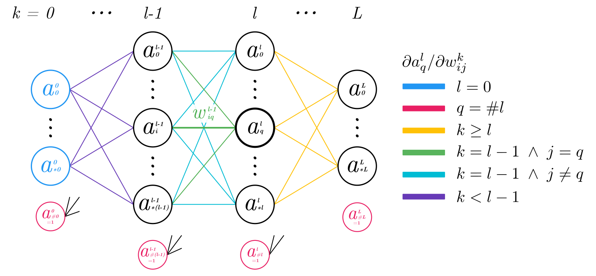

<!-- HTML BEGIN -->
<!-- Click [here](https://mateosss.github.io/nnet/article-es.pdf)
to read this article in pdf. -->
<!-- HTML END -->

# Feedforward Network Implementation

*By Mateo de Mayo - <mateodemayo@gmail.com>*

Neural Networks 2020 - FaMAF, UNC - February 2021

## Introduction

The process of deriving and implementing a multilayer feedforward neural network
is explored and its difficulties are analyzed to get a better understanding of
current models. A naive algorithm for the computation of gradients is derived
and implemented and it is compared against more standard gradient descent
techniques based on backpropagation as the ones offered by PyTorch. This
procedure is initially implemented in python with the help of the NumPy library
and, because of both the inefficient method of weight updates and the additional
cost of the Python interpreter, many performance challenges arise. These
problems are tackled through the use of both Cython and CPU parallelism. The
final result, far from being optimal, is adequate enough for training a
classifier and an autoencoder over the [MNIST] dataset in reasonable amounts of
time.

## Derivación

A big part of the workings of feedforward networks is relatively intuitive, the
major challenge comes in the derivation and implementation of the weights update
step. This update is usually done through gradient descent and, in particular,
through the backpropagation algorithm. It is worth noting that there are many
ways of minimizing a function like the cost function; in this study a version
that updates the weights of the network through genetic algorithms was
implemented and, while it is suboptimal not being able to even surpass the 25%
mark of precision on the MNIST classifier, this method shows that even very
simple algorithms are able to make the network learn certain patterns. The model
further developed in this study uses gradient descent with an algorithm that is
not backpropagation which is derived below.

<!-- HTML BEGIN  -->
<!-- 

<i>
Figure 1: Network diagram and notation. Colors will be useful in the derivation
by cases that follows.
</i>

  -->
<!-- HTML END  -->
<!-- LATEX BEGIN -->
\begin{figure}[h]
  \centering
  \includegraphics[width=1.0\textwidth]{res/network-diagram.pdf}
  \caption{\emph{Network diagram and notation. Colors will be useful in the
    derivation by cases that follows.}}
  \label{network-diagram}
\end{figure}
<!-- LATEX END -->

*A more detailed version of the formula development that follows can be found in
the [handwritten notes][handwritten-notes].*

The mean squared error (MSE) will be used as the cost function for the output
layer against the expected target.

$$
E(\vec s, \vec t) = \frac 1 {\#L} \sum^{*L}_{q=0}{(O_q - t_q)^2}
$$

<!-- HTML BEGIN -->
<!--**Notation**
- $\vec s$: input
- $\vec t$: target
- $O_q$: network output $q$
- $L$: last layer index
- $*L$: index of the last neuron in layer $L$
- $\# L$: layer $L$ size -->
<!-- HTML END -->

<!-- LATEX BEGIN -->
\begin{flushleft}
\bigskip
\textbf{Notation}
$\bullet$ $\vec s$: input
$\bullet$ $\vec t$: target
$\bullet$ $O_q$: network output $q$
$\bullet$ $L$: last layer index\\
\hspace*{4.55em} $\bullet$ $*L$: index of the last neuron in layer $L$
$\bullet$ $\# L$: layer $L$ size
\bigskip
\end{flushleft}
<!-- LATEX END -->

We express the loss function gradient with respect to a specific weight.

$$
\tag{1}
\nabla E^k_{ij}
:= \frac {\partial E(\vec s, \vec t)} {\partial w^k_{ij}}
= \frac 2 {\# L} \sum_{q=0}^{*L} (O_q - t_q)
\frac {\partial a^L_q} {\partial w^k_{ij}}
$$

<!-- HTML BEGIN -->
<!-- **Notation**
- $w^k_{ij}$: neuron $i$ weight from layer $k$ to neuron $j$ from layer $k+1$
- $a^L_q$: neuron $q$ output from layer $L$. Being the last layer, it *is*
  $O_q$

  -->
<!-- HTML END -->

<!-- LATEX BEGIN -->
\begin{flushleft}
\bigskip
\textbf{Notation}
$\bullet$ $w^k_{ij}$: neuron $i$ weight from layer $k$ to neuron $j$ from layer
$k+1$\\
\hspace*{4.55em} $\bullet$ $a^L_q$: neuron $q$ output from layer $L$. Being the
last layer, it \emph{is} $O_q$.
\bigskip
\end{flushleft}
<!-- LATEX END -->

<!-- HTML BEGIN -->
<!-- >  
> -->
<!-- HTML END -->
> **Note:** It is at this point where the derivation has diverged from the
> standard way of calculating the formulas that would lead to the implementation
> of the backpropagation algorithm. The difference resides in expressing
> $\nabla E^k_{ij}$ in the following way
> $$
> \nabla E^k_{ij} = \frac {\partial E(\vec s, \vec t)} {\partial w^k_{ij}} =
> \frac 1 {\# L} \sum_{q=0}^{*L} \delta^k_j \frac {\partial h^k_{j}} {\partial
> w^k_{ij}}
> $$
>
> Where
>
> - $h^k_j$: linear input of neuron $j$ from layer $k$ (before applying $g$)
>
> - $\delta^k_j := \frac {(O_q - t_q)^2} {\partial h^k_{j}}$: usually called
>   the error term.
>
> Continuing the derivation with these factors, the layer $k$ gradients can be
> stated as a function of the error terms $\delta^{k+1}_j$ from the posterior
> layer and, in this way, sweeping from output to input and propagating the
> error terms it is possible to calculate all gradients and thus the name
> *backpropagation*. It will be seen that, conversely, the derivation presented
> in this study will depend on previous layers and therefore it will sweep from
> the input to the output layers. We will colloquially call its implementation
> *frontpropagation* (not to be confused with the network *forward pass*).
>
> ​ <!-- This line has a hidden whitespace character for padding -->

Continuando desde $(1)$ es posible ver que se necesitará analizar $\frac
{\partial a^l_q} {\partial w^k_{ij}}$ para $l = 0, \ldots, L$, *(i.e. cómo
afecta el peso $w^k_{ij}$ a cada neurona $a^l_q$)* y así poder finalmente
computar $\frac {\partial a^L_q} {\partial w^k_{ij}}$.

<!-- HTML BEGIN -->
<!--**Notación**
- $g$: función de activación utilizada en todas las capas. -->
<!-- HTML END -->

<!-- LATEX BEGIN -->
\begin{flushleft}
\bigskip
\textbf{Notación}
$\bullet$ $g$: función de activación utilizada en todas las capas.
\bigskip
\end{flushleft}
<!-- LATEX END -->

Estamos ahora en posición de analizar por casos el valor de $\frac {\partial
a^l_q} {\partial w^k_{ij}}$. Notar que cada uno de estos casos se encuentra
<!-- HTML BEGIN -->
<!-- ilustrado en el [diagrama](#network-diagram) anterior. -->
<!-- HTML END -->
<!-- LATEX BEGIN -->
ilustrado en el $\hyperref[network-diagram]{diagrama}$ anterior.
<!-- LATEX END -->

- Si $l = 0$ (capa de entrada) $\Rightarrow \frac {\partial a^l_q} {\partial
  w^k_{ij}} = 0$
  ya que $a^0_q$ es una constante de entrada.

- Sino, si $q = \#l$ (neurona de bias) $\Rightarrow \frac {\partial a^l_q}
  {\partial w^k_{ij}} = 0$
  ya que la neurona bias es constantemente 1.

- Sino, si $k \ge l$ (peso posterior a neurona) $\Rightarrow \frac {\partial
  a^l_q} {\partial w^k_{ij}} = 0$
  ya que tal peso no influye en la activación.

- Sino, si $k = l - 1$ (peso inmediato a la neurona) $\Rightarrow \frac
  {\partial a^l_q} {\partial w^k_{ij}} = g'(h^l_q) \frac {\partial h^l_q}
  {\partial w^k_{ij}}$.

    Teniendo en cuenta que $h^l_q = \sum_{r=0}^{\# (l - 1)} a^{l-1}_r
    w^{l-1}_{rq}$, dividimos en dos subcasos, cuando el peso llega a la
    neurona $q$ y cuando no, para determinar la derivada parcial
    $\frac {\partial h^l_q} {\partial w^k_{ij}}$ lo que resulta en:

    - Si $j = q \Rightarrow \frac {\partial a^l_q} {\partial w^k_{ij}} =
      g'(h^l_q) \cdot a^k_i$

    - Si $j \ne q \Rightarrow \frac {\partial a^l_q} {\partial w^k_{ij}} =
      g'(h^l_q) \cdot 0 = 0$

- Sino, si $k < l - 1$ (peso no inmediato a la neurona)
  $\Rightarrow \frac
  {\partial a^l_q} {\partial w^k_{ij}} = g'(h^l_q) \cdot
  \sum^{*(l-1)}_{r=0}{w^{l-1}_{rq} \frac {\partial a^{l-1}_r} {\partial
  w^k_{ij}}}$

Con esto ya es suficiente para tener una fórmula recursiva bien definida. En la
implementación además se define el caso $k = l - 2$, es decir cuando el peso es
casi inmediato a la neurona, con el fin de reducir la computación extra generada
por la recursividad.

En conclusión, según los valores de $l$, $q$, $k$, $i$ y $j$, tenemos que:

$$
\tag{2}
\frac {\partial a^l_q} {\partial w^k_{ij}} = g'(h^l_q) \cdot \left\{
    \begin{array}{ll}
        0\\
        a^k_i\\
        \sum^{*(l-1)}_{r=0}{w^{l-1}_{rq}
            \frac {\partial a^{l-1}_r} {\partial w^k_{ij}}}
    \end{array}
\right.
$$

## Implementación

Al implementar tanto la fórmula anterior en este algoritmo de frontpropagation
como el resto de los aspectos de la red surgen distintas particularidades que se
detallan en esta sección.

La derivación anterior de $\frac {\partial a^l_q} {\partial w^k_{ij}}$ puede
verse reflejada en la implementación del método [`PyNet.dadw`]. Con este método
es ahora posible calcular, aunque de forma ineficiente, los gradientes y
actualizar los pesos con ellos. Se realizaron *chequeos numéricos* para poner a
prueba la correctitud de la implementación del cálculo del gradiente.

Se replantea el problema en función de *matrices* para aprovecharse de las
mejoras de rendimiento proporcionadas por `NumPy` *(ver clase [`NpNet`])*. La
explicación de las distintas transformaciones que se realizan escapan al alcance
de este trabajo pero pueden verse en detalle en las notas manuscritas, en la
sección de *"[matricization]"*.

Además, como esperamos utilizar minibatches, prepararemos a la red para *correr
de a batches*. En lugar de tomar una única entrada y devolver una única capa de
salida, vectorizaremos la corrida para que la red reciba y devuelva la misma
cantidad de entradas y salidas que el tamaño del minibatch.

Para lograr mejoras en los tiempos de ejecución se utilizan técnicas de
*programación dinámica* para aliviar el trabajo extra que significa la
recursividad en la actualización de pesos. También se utiliza *Cython*, un
superconjunto de Python que transpila a C, para reescribir y paralelizar con
OpenMP porciones del código que lo ameriten para mayor rendimiento. En el
proceso se utilizan diversos profilers como `line_profile`, `cProfile` y `perf`
para entender mejor los *hotspots* del código. Por cada cuello de botella
detectado con un profiler se lo reescribe utilizando de forma extensiva el
conocimiento de las ecuaciones y transformaciones de aritmética matricial que
puedan ser de beneficio computacional. Si bien la versión [más
performante][cynet-getgradients] pierde legibilidad en contraste con la
[original][pynet-getgradients], es esencial entender que no es más que una
transformación aritmética.

Luego de estas mejoras, la implementación gana un rendimiento sustancial que,
pese a no estar completamente optimizado, es suficiente como para entrenar en
tiempos razonables las arquitecturas deseadas. El tiempo de entrenamiento por
época del clasificador de dígitos MNIST con arquitectura `28² x 16 x 16 x 10`
puede verse reflejado en la siguiente tabla comparándose la versión que calculan
los gradientes en Python puro [`PyNet`] (`py`), la que usa NumPy [`NpNet`]
(`np`), la paralelizada con Cython [`CyNet`] (`cy`) y la versión que usa el
estado del arte que se asume está implementado en PyTorch `tr` (recordar que
esta última implementa backpropagation y no el algoritmo más ingenuo e
ineficiente de frontpropagation presentado en este trabajo).

| *Versión* | i7 7700HQ x1 | E5 2680 x1 | i7 7700HQ x4 | E5 2680 x24 |
|---|---|---|---|---|
| `py` | 405  | 467  | — | — |
| `np` | 6.31 | 7.14 | — | — |
| `cy` | 3.97 | 4.23 | 1.71 | 0.63 |
| `tr` | 0.08 | 0.10 | — | — |

<!-- HTML BEGIN -->
<!-- 
<i>
Tiempos de entrenamiento de una época en segundos sobre distintas CPUs
</i>
 -->
<!-- HTML END -->

<!-- LATEX BEGIN -->
\begin{center}
\emph{Tiempos de entrenamiento de una época en segundos sobre distintas CPUs}
\end{center}
<!-- LATEX END -->

## Desempeño de la Red

Se utiliza la implementación para modelar dos redes sobre el conjunto de dígitos
manuscritos [MNIST]. Un clasificador con arquitectura `28² x 16 x 16 x 10` que
reconoce el dígito escrito y un autoencoder `28² x 64 x 28²` que imita la
función identidad para el dominio de los datos. Se implementan también las
mismas redes en PyTorch. Ambos modelos utilizan MSE y SGD con momentum 0.5 y
learning rate 10, tamaño de minibatch 1000, función sigmoide como activación en
todas las neuronas y sin ningún método de regularización. Los siguientes
resultados son sobre el conjunto de validación, los resultados sobre el conjunto
de entrenamiento son virtualmente idénticos.

Cabe aclarar que si bien tanto la implementación `Nnet` de este trabajo como la
versión en `PyTorch` utilizan la [misma][kaiming-pytorch-docs] inicialización de
pesos basada en [Kaiming][kaiming-paper] sobre una distribución uniforme, los
bias en la versión `PyTorch` son inicializados de forma levemente distinta. A
esto y al azar inherente a la corrida se le atribuyen las pequeñas diferencias
de performance de las redes. Para mostrar este punto se grafica además una
versión `Nnet*` que utiliza una forma de [inicialización][custom-initialization]
más ingenua (i.e. $\frac {\mathcal{N}(0, 1)} {\sqrt{fanin}}$) que en estas
arquitecturas parece mejorar el rendimiento.

<!-- HTML BEGIN -->
<!--

 -->
<!-- HTML END -->

<!-- LATEX BEGIN -->
\begin{center}
  \includegraphics[width=.5\textwidth]{res/auto_losses_es.pdf}
\end{center}
<!-- LATEX END -->

Notar la similitud de las versiones `Nnet` y `PyTorch`. Esto muestra que nuestro
algoritmo de frontpropagation parece estar dando los mismos resultados que el
backpropagation clásico. Efectivamente si se inicializan las dos redes con los
mismos pesos los resultados no presentan diferencia significativa, incluso con
las aleatoriedades propias del descenso estocástico.

## Conclusiones

Quedan aún varias características a implementar que mejorarían el rendimiento y
desempeño de este trabajo. Dropout, backpropagation, actualización ADAM, función
de error cross entropy, offloading a GPUs, entre otras son algunas de las
posibles mejoras a abordar. Teniendo el conocimiento de la red completo se
facilita mucho su puesta a punto para aplicaciones específicas de estos
algoritmos así como también la exploración de técnicas novedosas. En particular,
procedimientos de autodiferenciación como los usados por PyTorch o TensorFlow
serían de gran utilidad ya que sobrecargando operadores permiten calcular,
mediante la regla de la cadena, los gradientes sobre cualquier composición de
operaciones y permitirían mayor flexibilidad a la hora de elegir las funciones
utilizadas por la red.

Se ha implementado una red neuronal desde los conceptos básicos derivando en el
proceso un algoritmo de actualización de pesos que es correcto. Se ha mostrado
que a pesar de ser poco eficiente, logra entrenar redes de tamaños
significativos en tiempos aceptables. El conocimiento obtenido en el proceso es
de gran valor y permite obtener una mayor solvencia en la implementación de
nuevas técnicas sobre las redes.

<!-- Referencias -->

[MNIST]: http://yann.lecun.com/exdb/mnist/
[kaiming-pytorch-docs]: https://pytorch.org/docs/stable/nn.init.html#torch.nn.init.kaiming_uniform_
[kaiming-paper]: https://arxiv.org/abs/1502.01852v1
[`PyNet.dadw`]: https://github.com/mateosss/nnet/blob/d6e1aae73915fa71bd4a9ce6f31a8192039c3c07/nets/pynet.py#L13
[`PyNet`]: https://github.com/mateosss/nnet/tree/d6e1aae73915fa71bd4a9ce6f31a8192039c3c07/nets/pynet.py#L6
[`NpNet`]: https://github.com/mateosss/nnet/tree/d6e1aae73915fa71bd4a9ce6f31a8192039c3c07/nets/npnet.py#L6
[`CyNet`]: https://github.com/mateosss/nnet/tree/d6e1aae73915fa71bd4a9ce6f31a8192039c3c07/nets
[pynet-getgradients]: https://github.com/mateosss/nnet/blob/d6e1aae73915fa71bd4a9ce6f31a8192039c3c07/nets/pynet.py#L59
[matricization]: https://mateosss.github.io/nnet/notes.pdf#page=4
[handwritten-notes]: https://mateosss.github.io/nnet/notes.pdf#page=2
[cynet-getgradients]: https://github.com/mateosss/nnet/blob/d6e1aae73915fa71bd4a9ce6f31a8192039c3c07/nets/cynet_native.pyx#L113
[custom-initialization]: https://github.com/mateosss/nnet/blob/d6e1aae73915fa71bd4a9ce6f31a8192039c3c07/nets/nnet.py#L72
