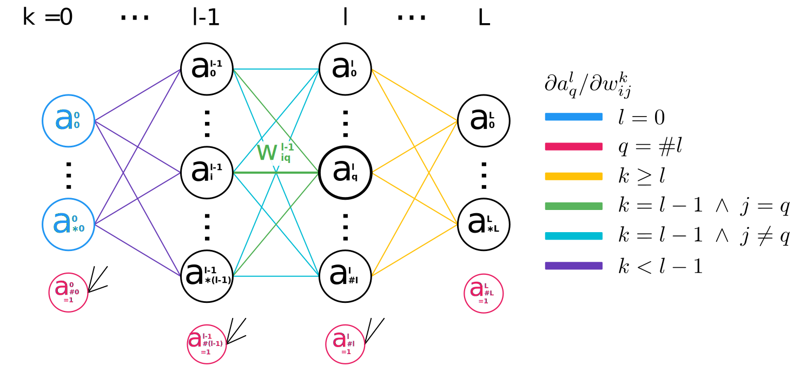
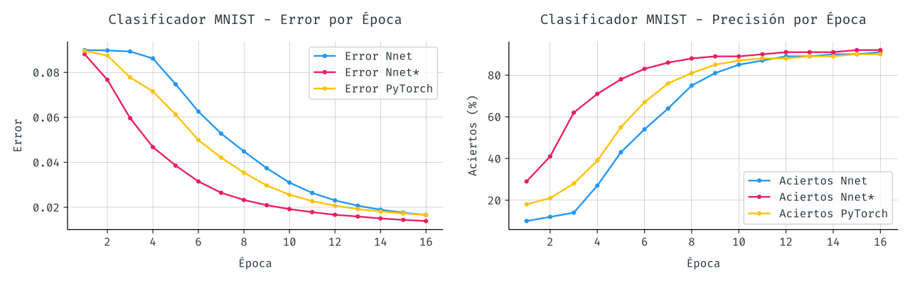
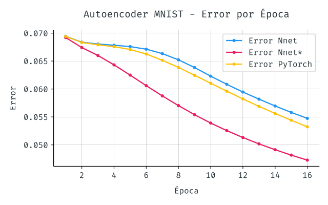

<!-- HTML BEGIN -->
<!-- Haga click [aquí](https://mateosss.github.io/nnet/article-es.pdf)
para leer el artículo en pdf. -->
<!-- HTML END -->

# Implementación Red Feedforward

*Por Mateo de Mayo - <mateodemayo@gmail.com>*

Redes Neuronales 2020 - FaMAF, UNC - Febrero 2021

## Introducción

Se explora el proceso de derivación e implementación de una red neuronal
feedforward multicapa y se analizan sus complicaciones para lograr un mejor
entendimiento de los modelos actuales. Se deriva e implementa un algoritmo para
el cálculo de los gradientes de forma ingenua y se lo contrasta con el estándar
de backpropagation ofrecido por PyTorch. La implementación se realiza
inicialmente en Python con la ayuda de la librería NumPy y tanto por el método
ineficiente de actualización de gradientes como por el costo adicional del
lenguaje interpretado surgen varios desafíos de performance que son abordados
mediante el uso de Cython y paralelismo en CPU. El resultado final, lejos de ser
óptimo, es adecuado para el entrenamiento de un clasificador y un autoencoder
sobre los datos de [MNIST] en tiempos razonables.

## Derivación

Gran parte del funcionamiento de las redes feedforward es relativamente
intuitivo, el mayor desafío está en la correcta derivación e implementación del
paso de actualización de pesos. La forma usual de esta actualización es mediante
el descenso por el gradiente, en particular mediante el algoritmo de
backpropagation. Vale aclarar que hay muchas formas de minimizar una función
como la de costo. Se implementó una versión que actualiza los pesos mediante
algoritmos genéticos que, si bien es subóptima no logrando superar el 25% de
precisión en el clasificador MNIST, muestra que incluso algoritmos tan sencillos
logran hacer que la red aprenda ciertos patrones. El modelo desarrollado en este
trabajo utilizará descenso por el gradiente pero con un algoritmo distinto a
backpropagation que se deriva a continuación.

<!-- HTML BEGIN  -->
<!-- 

<i>
Figura 1: Diagrama y notación de la red. Los colores serán útiles al derivar por casos.
</i>

  -->
<!-- HTML END  -->
<!-- LATEX BEGIN -->
\begin{figure}[h]
  \centering
  \includegraphics[width=1.0\textwidth]{res/network-diagram.pdf}
  \caption{\emph{Diagrama y notación de la red. Los colores serán útiles al
    derivar por casos.}}
  \label{network-diagram}
\end{figure}
<!-- LATEX END -->

*Una versión más detallada del desarrollo que sigue puede encontrarse en
las [notas manuscritas][handwritten-notes].*

Utilizaremos como función de costo el error cuadrático medio (MSE) de la capa de
salida contra el objetivo esperado:

$$
E(\vec s, \vec t) = \frac 1 {\#L} \sum^{*L}_{q=0}{(O_q - t_q)^2}
$$

<!-- En donde -->

<!-- HTML BEGIN -->
<!--**Notación**
- $\vec s$: entrada
- $\vec t$: objetivo
- $O_q$: salida $q$ de la red
- $L$: índice de última capa
- $*L$: índice de la última neurona de la capa $L$
- $\# L$: tamaño de la capa $L$ -->
<!-- HTML END -->

<!-- LATEX BEGIN -->
\begin{flushleft}
\bigskip
\textbf{Notación}
$\bullet$ $\vec s$: entrada
$\bullet$ $\vec t$: objetivo
$\bullet$ $O_q$: salida $q$ de la red
$\bullet$ $L$: índice de última capa\\
\hspace*{4.55em} $\bullet$ $*L$: índice de la última neurona de la capa $L$
$\bullet$ $\# L$: tamaño de la capa $L$
\bigskip
\end{flushleft}
<!-- LATEX END -->

Expresamos el gradiente de la función de error con respecto a un peso
específico.

$$
\tag{1}
\nabla E^k_{ij}
:= \frac {\partial E(\vec s, \vec t)} {\partial w^k_{ij}}
= \frac 2 {\# L} \sum_{q=0}^{*L} (O_q - t_q)
\frac {\partial a^L_q} {\partial w^k_{ij}}
$$

<!-- HTML BEGIN -->
<!-- **Notación**
- $w^k_{ij}$: peso de neurona $i$ de capa $k$ a neurona $j$ de capa $k+1$
- $a^L_q$: salida de la neurona $q$ de la capa $L$. Al ser la última capa *es*
  $O_q$.

  -->
<!-- HTML END -->

<!-- LATEX BEGIN -->
\begin{flushleft}
\bigskip
\textbf{Notación}
$\bullet$ $w^k_{ij}$: peso de neurona $i$ de capa $k$ a neurona $j$ de capa
$k+1$\\
\hspace*{4.55em} $\bullet$ $a^L_q$: salida de la neurona $q$ de la capa $L$. Al
  ser la última capa \emph{es} $O_q$.
\bigskip
\end{flushleft}
<!-- LATEX END -->

<!-- HTML BEGIN -->
<!-- >  
> -->
<!-- HTML END -->
> **Nota:** Es en este punto en dónde se ha divergido de la derivación estándar
> que llevaría a la implementación del algoritmo de backpropagation. La
> diferencia reside en plantear $\nabla E^k_{ij}$ de la siguiente manera
> $$
> \nabla E^k_{ij} = \frac {\partial E(\vec s, \vec t)} {\partial w^k_{ij}} =
> \frac 1 {\# L} \sum_{q=0}^{*L} \delta^k_j \frac {\partial h^k_{j}} {\partial
> w^k_{ij}}
> $$
>
> En donde
>
> - $h^k_j$: entrada lineal de la neurona $j$ de la capa $k$ (antes de aplicar
>   $g$)
>
> - $\delta^k_j := \frac {(O_q - t_q)^2} {\partial h^k_{j}}$: llamado usualmente
>   término de error.
>
> Siguiendo la derivación con estos factores se llegan a plantear los gradientes
> de la capa $k$ en función de los términos de error $\delta^{k+1}_j$ de la capa
> posterior y es de esta forma que barriendo desde la salida hacia la entrada y
> propagando los términos de error es posible calcular todos los gradientes, de
> aquí el nombre *backpropagation*. Veremos que, por el contrario, la derivación
> presentada aquí dependerá de capas previas y por lo tanto hará un barrido
> desde la capa de entrada a la de salida. Llamaremos coloquialmente a su
> implementación *frontpropagation* (no confundir con el *forward pass* de la
> red).
>
> ​ <!-- This line has a hidden whitespace character for padding -->

Continuando desde $(1)$ es posible ver que se necesitará analizar $\frac
{\partial a^l_q} {\partial w^k_{ij}}$ para $l = 0, \ldots, L$, *(i.e. cómo
afecta el peso $w^k_{ij}$ a cada neurona $a^l_q$)* y así poder finalmente
computar $\frac {\partial a^L_q} {\partial w^k_{ij}}$.

<!-- HTML BEGIN -->
<!--**Notación**
- $g$: función de activación utilizada en todas las capas. -->
<!-- HTML END -->

<!-- LATEX BEGIN -->
\begin{flushleft}
\bigskip
\textbf{Notación}
$\bullet$ $g$: función de activación utilizada en todas las capas.
\bigskip
\end{flushleft}
<!-- LATEX END -->

Estamos ahora en posición de analizar por casos el valor de $\frac {\partial
a^l_q} {\partial w^k_{ij}}$. Notar que cada uno de estos casos se encuentra
<!-- HTML BEGIN -->
<!-- ilustrado en el [diagrama](#network-diagram) anterior. -->
<!-- HTML END -->
<!-- LATEX BEGIN -->
ilustrado en el $\hyperref[network-diagram]{diagrama}$ anterior.
<!-- LATEX END -->

- Si $l = 0$ (capa de entrada) $\Rightarrow \frac {\partial a^l_q} {\partial
  w^k_{ij}} = 0$
  ya que $a^0_q$ es una constante de entrada.

- Sino, si $q = \#l$ (neurona de bias) $\Rightarrow \frac {\partial a^l_q}
  {\partial w^k_{ij}} = 0$
  ya que la neurona bias es constantemente 1.

- Sino, si $k \ge l$ (peso posterior a neurona) $\Rightarrow \frac {\partial
  a^l_q} {\partial w^k_{ij}} = 0$
  ya que tal peso no influye en la activación.

- Sino, si $k = l - 1$ (peso inmediato a la neurona) $\Rightarrow \frac
  {\partial a^l_q} {\partial w^k_{ij}} = g'(h^l_q) \frac {\partial h^l_q}
  {\partial w^k_{ij}}$.

    Teniendo en cuenta que $h^l_q = \sum_{r=0}^{\# (l - 1)} a^{l-1}_r
    w^{l-1}_{rq}$, dividimos en dos subcasos, cuando el peso llega a la
    neurona $q$ y cuando no, para determinar la derivada parcial
    $\frac {\partial h^l_q} {\partial w^k_{ij}}$ lo que resulta en:

    - Si $j = q \Rightarrow \frac {\partial a^l_q} {\partial w^k_{ij}} =
      g'(h^l_q) \cdot a^k_i$

    - Si $j \ne q \Rightarrow \frac {\partial a^l_q} {\partial w^k_{ij}} =
      g'(h^l_q) \cdot 0 = 0$

- Sino, si $k < l - 1$ (peso no inmediato a la neurona)
  $\Rightarrow \frac
  {\partial a^l_q} {\partial w^k_{ij}} = g'(h^l_q) \cdot
  \sum^{*(l-1)}_{r=0}{w^{l-1}_{rq} \frac {\partial a^{l-1}_r} {\partial
  w^k_{ij}}}$

Con esto ya es suficiente para tener una fórmula recursiva bien definida. En la
implementación además se define el caso $k = l - 2$, es decir cuando el peso es
casi inmediato a la neurona, con el fin de reducir la computación extra generada
por la recursividad.

En conclusión, según los valores de $l$, $q$, $k$, $i$ y $j$, tenemos que:

$$
\tag{2}
\frac {\partial a^l_q} {\partial w^k_{ij}} = g'(h^l_q) \cdot \left\{
    \begin{array}{ll}
        0\\
        a^k_i\\
        \sum^{*(l-1)}_{r=0}{w^{l-1}_{rq}
            \frac {\partial a^{l-1}_r} {\partial w^k_{ij}}}
    \end{array}
\right.
$$

## Implementación

Al implementar tanto la fórmula anterior en este algoritmo de frontpropagation
como el resto de los aspectos de la red surgen distintas particularidades que se
detallan en esta sección.

La derivación anterior de $\frac {\partial a^l_q} {\partial w^k_{ij}}$ puede
verse reflejada en la implementación del método [`PyNet.dadw`]. Con este método
es ahora posible calcular, aunque de forma ineficiente, los gradientes y
actualizar los pesos con ellos. Se realizaron *chequeos numéricos* para poner a
prueba la correctitud de la implementación del cálculo del gradiente.

Se replantea el problema en función de *matrices* para aprovecharse de las
mejoras de rendimiento proporcionadas por `NumPy` *(ver clase [`NpNet`])*. La
explicación de las distintas transformaciones que se realizan escapan al alcance
de este trabajo pero pueden verse en detalle en las notas manuscritas, en la
sección de *"[matricization]"*.

Además, como esperamos utilizar minibatches, prepararemos a la red para *correr
de a batches*. En lugar de tomar una única entrada y devolver una única capa de
salida, vectorizaremos la corrida para que la red reciba y devuelva la misma
cantidad de entradas y salidas que el tamaño del minibatch.

Para lograr mejoras en los tiempos de ejecución se utilizan técnicas de
*programación dinámica* para aliviar el trabajo extra que significa la
recursividad en la actualización de pesos. También se utiliza *Cython*, un
superconjunto de Python que transpila a C, para reescribir y paralelizar con
OpenMP porciones del código que lo ameriten para mayor rendimiento. En el
proceso se utilizan diversos profilers como `line_profile`, `cProfile` y `perf`
para entender mejor los *hotspots* del código. Por cada cuello de botella
detectado con un profiler se lo reescribe utilizando de forma extensiva el
conocimiento de las ecuaciones y transformaciones de aritmética matricial que
puedan ser de beneficio computacional. Si bien la versión [más
performante][cynet-getgradients] pierde legibilidad en contraste con la
[original][pynet-getgradients], es esencial entender que no es más que una
transformación aritmética.

Luego de estas mejoras, la implementación gana un rendimiento sustancial que,
pese a no estar completamente optimizado, es suficiente como para entrenar en
tiempos razonables las arquitecturas deseadas. El tiempo de entrenamiento por
época del clasificador de dígitos MNIST con arquitectura `28² x 16 x 16 x 10`
puede verse reflejado en la siguiente tabla comparándose la versión que calculan
los gradientes en Python puro [`PyNet`] (`py`), la que usa NumPy [`NpNet`]
(`np`), la paralelizada con Cython [`CyNet`] (`cy`) y la versión que usa el
estado del arte que se asume está implementado en PyTorch `tr` (recordar que
esta última implementa backpropagation y no el algoritmo más ingenuo e
ineficiente de frontpropagation presentado en este trabajo).

| *Versión* | i7 7700HQ x1 | E5 2680 x1 | i7 7700HQ x4 | E5 2680 x24 |
|---|---|---|---|---|
| `py` | 405  | 467  | — | — |
| `np` | 6.31 | 7.14 | — | — |
| `cy` | 3.97 | 4.23 | 1.71 | 0.63 |
| `tr` | 0.08 | 0.10 | — | — |

<!-- HTML BEGIN -->
<!-- 
<i>
Tiempos de entrenamiento de una época en segundos sobre distintas CPUs
</i>
 -->
<!-- HTML END -->

<!-- LATEX BEGIN -->
\begin{center}
\emph{Tiempos de entrenamiento de una época en segundos sobre distintas CPUs}
\end{center}
<!-- LATEX END -->

## Desempeño de la Red

Se utiliza la implementación para modelar dos redes sobre el conjunto de dígitos
manuscritos [MNIST]. Un clasificador con arquitectura `28² x 16 x 16 x 10` que
reconoce el dígito escrito y un autoencoder `28² x 64 x 28²` que imita la
función identidad para el dominio de los datos. Se implementan también las
mismas redes en PyTorch. Ambos modelos utilizan MSE y SGD con momentum 0.5 y
learning rate 10, tamaño de minibatch 1000, función sigmoide como activación en
todas las neuronas y sin ningún método de regularización. Los siguientes
resultados son sobre el conjunto de validación, los resultados sobre el conjunto
de entrenamiento son virtualmente idénticos.

Cabe aclarar que si bien tanto la implementación `Nnet` de este trabajo como la
versión en `PyTorch` utilizan la [misma][kaiming-pytorch-docs] inicialización de
pesos basada en [Kaiming][kaiming-paper] sobre una distribución uniforme, los
bias en la versión `PyTorch` son inicializados de forma levemente distinta. A
esto y al azar inherente a la corrida se le atribuyen las pequeñas diferencias
de performance de las redes. Para mostrar este punto se grafica además una
versión `Nnet*` que utiliza una forma de [inicialización][custom-initialization]
más ingenua (i.e. $\frac {\mathcal{N}(0, 1)} {\sqrt{fanin}}$) que en estas
arquitecturas parece mejorar el rendimiento.

<!-- HTML BEGIN -->
<!--

 -->
<!-- HTML END -->

<!-- LATEX BEGIN -->
\begin{center}
  \includegraphics[width=.5\textwidth]{res/auto_losses_es.pdf}
\end{center}
<!-- LATEX END -->

Notar la similitud de las versiones `Nnet` y `PyTorch`. Esto muestra que nuestro
algoritmo de frontpropagation parece estar dando los mismos resultados que el
backpropagation clásico. Efectivamente si se inicializan las dos redes con los
mismos pesos los resultados no presentan diferencia significativa, incluso con
las aleatoriedades propias del descenso estocástico.

## Conclusiones

Quedan aún varias características a implementar que mejorarían el rendimiento y
desempeño de este trabajo. Dropout, backpropagation, actualización ADAM, función
de error cross entropy, offloading a GPUs, entre otras son algunas de las
posibles mejoras a abordar. Teniendo el conocimiento de la red completo se
facilita mucho su puesta a punto para aplicaciones específicas de estos
algoritmos así como también la exploración de técnicas novedosas. En particular,
procedimientos de autodiferenciación como los usados por PyTorch o TensorFlow
serían de gran utilidad ya que sobrecargando operadores permiten calcular,
mediante la regla de la cadena, los gradientes sobre cualquier composición de
operaciones y permitirían mayor flexibilidad a la hora de elegir las funciones
utilizadas por la red.

Se ha implementado una red neuronal desde los conceptos básicos derivando en el
proceso un algoritmo de actualización de pesos que es correcto. Se ha mostrado
que a pesar de ser poco eficiente, logra entrenar redes de tamaños
significativos en tiempos aceptables. El conocimiento obtenido en el proceso es
de gran valor y permite obtener una mayor solvencia en la implementación de
nuevas técnicas sobre las redes.

<!-- Referencias -->

[MNIST]: http://yann.lecun.com/exdb/mnist/
[kaiming-pytorch-docs]: https://pytorch.org/docs/stable/nn.init.html#torch.nn.init.kaiming_uniform_
[kaiming-paper]: https://arxiv.org/abs/1502.01852v1
[`PyNet.dadw`]: https://github.com/mateosss/nnet/blob/d6e1aae73915fa71bd4a9ce6f31a8192039c3c07/nets/pynet.py#L13
[`PyNet`]: https://github.com/mateosss/nnet/tree/d6e1aae73915fa71bd4a9ce6f31a8192039c3c07/nets/pynet.py#L6
[`NpNet`]: https://github.com/mateosss/nnet/tree/d6e1aae73915fa71bd4a9ce6f31a8192039c3c07/nets/npnet.py#L6
[`CyNet`]: https://github.com/mateosss/nnet/tree/d6e1aae73915fa71bd4a9ce6f31a8192039c3c07/nets
[pynet-getgradients]: https://github.com/mateosss/nnet/blob/d6e1aae73915fa71bd4a9ce6f31a8192039c3c07/nets/pynet.py#L59
[matricization]: https://mateosss.github.io/nnet/notes.pdf#page=4
[handwritten-notes]: https://mateosss.github.io/nnet/notes.pdf#page=2
[cynet-getgradients]: https://github.com/mateosss/nnet/blob/d6e1aae73915fa71bd4a9ce6f31a8192039c3c07/nets/cynet_native.pyx#L113
[custom-initialization]: https://github.com/mateosss/nnet/blob/d6e1aae73915fa71bd4a9ce6f31a8192039c3c07/nets/nnet.py#L72
